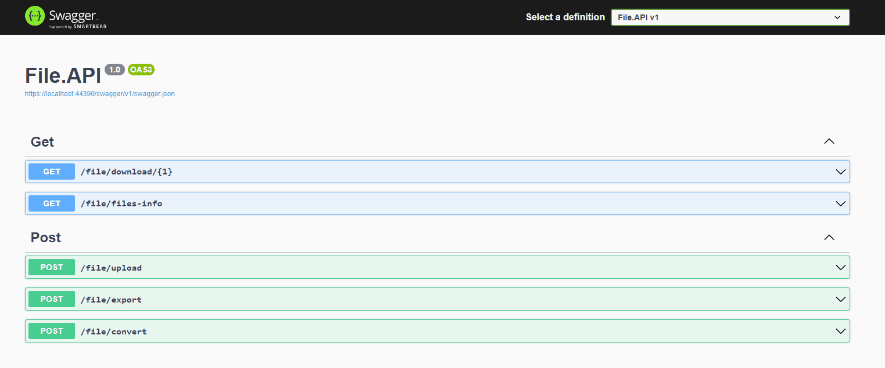
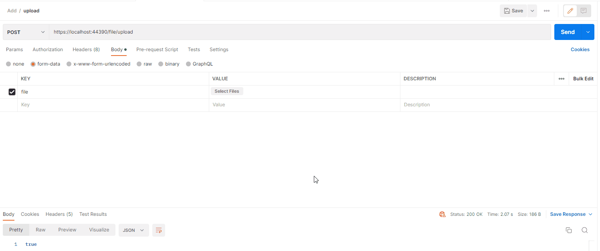
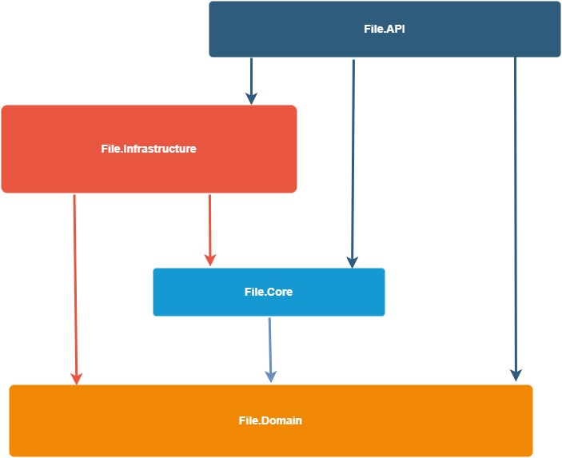

# IN PROGRESS

 

# Clean Architecture FileApi
REST API solution demonstrates how to create clean and modern API with Clean Architecture, minimal API and various of design patterns.

Example API allows to **upload/download files with .txt, .json, .csv, .xml, .yml extensions** and get collection of uploaded files. Also allow to **covert between json, xml, yml formats**.

# Menu
* [Get Started](#get-started)
* [Motivation](#motivation)
* [Architecture](#architecture)
* [Technologies](#technologies)

# Get Started
Simply Run File.API and try it in Swagger:

Or in case of You need to edit Content Type, use [Postman](https://www.postman.com/) instead:

# Motivation
Main motivation is to write practical example of minimal API with Clean Architecture and experiment with libraries for validation and mapping.

# Architecture

Projects folows **[Clean Architecture](https://learn.microsoft.com/en-us/dotnet/architecture/modern-web-apps-azure/common-web-application-architectures#clean-architecture)**, but application layer is splitted to Core and Domain projects where Core project holds business rules and Domain project contains business entities.

As Minimal API allows to inject handlers into endpoint map methods, I decided to do not use **[MediatR](https://github.com/jbogard/MediatR)**, but still every endpoint has its own request and handler. Solution folows **[CQRS pattern](https://learn.microsoft.com/en-us/azure/architecture/patterns/cqrs)**, it means that handlers are separated by commands and queries, command handlers handle command requests and query handlers handle query requests. Also repositories (**[Repository pattern](https://learn.microsoft.com/en-us/aspnet/mvc/overview/older-versions/getting-started-with-ef-5-using-mvc-4/implementing-the-repository-and-unit-of-work-patterns-in-an-asp-net-mvc-application)**) are separated by command and queries.

Instead of throwing exceptions, project use **[Result pattern](https://www.forevolve.com/en/articles/2018/03/19/operation-result/)** (using [FluentResuls package](https://github.com/altmann/FluentResults)) and for returning exact http response, every handler returns data wraped into HttpDataResponse object which contains also error messages collection and http response code.

Important part of every project are **[tests](https://github.com/Gramli/WeatherApi/tree/main/src/Tests)**. When writing tests we want to achieve [optimal code coverage](https://stackoverflow.com/questions/90002/what-is-a-reasonable-code-coverage-for-unit-tests-and-why). I think that every project has its own optimal code coverage number by it's need and I always follow the rule: **cover your code to be able refactor without worry about functionality change**.

In this solution, each 'code' project has its own unit test project and every **unit test** project copy the same directory structure as 'code' project, which is very helpful for orientation in test project. Infrastructure project has also **integration tests**, because for format conversion is used third party library and we want to know that conversion works always as expected (for example when we update library version).

#### Clean Architecture Layers

Solution contains four layers: 
* **File.API** - entry point of the application, top layer
	*  Endpoints
	*  Middlewares (or Filters)
	*  API Configuration
* **File.Infrastructure** - layer for communication with external resources like database, cache, web service.. 
	*  Repositories Implementation - access to database
	*  External Services Proxies - proxy classes implementation - to obtain data from external web services
	*  Infastructure Specific Services - services which are needed to interact with external libraries and frameworks
* **File.Core** - business logic of the application
	*  Request Handlers/Managers/.. - business implementation
	*  Abstractions - besides abstractions for business logic are there abstractions for Infrastructure layer (Service, Repository, ..) to be able use them in this (core) layer
* **File.Domain** - all what should be shared across all projects
	* DTOs
	* General Extensions

#### Horizontal Diagram (references)

## Technologies
* [ASP.NET Core 7](https://learn.microsoft.com/en-us/aspnet/core/introduction-to-aspnet-core?view=aspnetcore-7.0)
* [Entity Framework Core InMemory](https://learn.microsoft.com/en-us/ef/core/providers/in-memory/?tabs=dotnet-core-cli)
* [Mapster](https://github.com/MapsterMapper/Mapster)
* [FluentResuls](https://github.com/altmann/FluentResults)
* [Validot](https://github.com/bartoszlenar/Validot)
* [GuardClauses](https://github.com/ardalis/GuardClauses)
* [Moq](https://github.com/moq/moq4)
* [Xunit](https://github.com/xunit/xunit)
* [ChoETL](https://github.com/Cinchoo/ChoETL)
